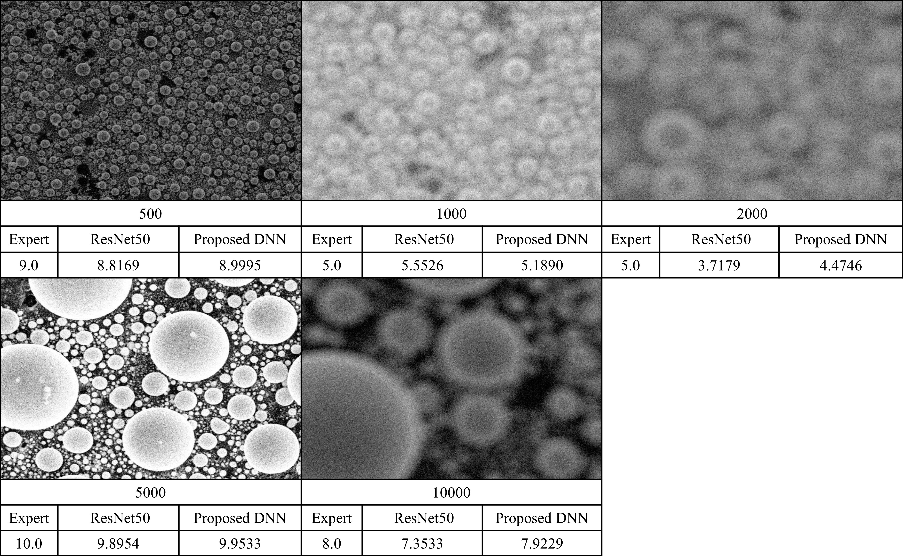

# Deep Autofocus with SEM
This repository contains the code for the paper [Robust Autofocus Score Prediction of SEM on Magnification Based on Deep Learning System]()
presented at Microscopy & MicroAnalysis (M&M 2020).

## Table of Contents
 * [Environment setting](#0-Environment-setting)
 * [Training a model](#1-Training-a-model)
 * [Validation](#2-Validation)
 * [Conventional algorithms](#3-Conventional-algorithms)
 * [Results](#4-Results)
 * [Citation](#5-Citation)
 * [Reference](#6-Reference)

### 0. Environment setting
```
#gpu
CUDA                    10.0
cudnn                   7.6.0

#package
pytorch                 1.1.0
torchvision             0.3.0
numpy                   1.16.4
matplotlib              3.1.1
pillow                  6.1.1
```

### 1. Training a model 
#### 1-1) Datasets
* **Datasets are prohibited to share**. 
* Datasets should be like this if you have datasets and want to run training code.

```
 mnm2019_dataset/
    ├── 01220_grid+tinball
    ├── grid_tinball_zero_20200206_refined
    ├── Data_0
    └── cache.txt

 mnm2019_dataset/
    ├── train/
    ├── test/
    └── cache.txt
```
```
#head of cache.txt
24501	2734	3037                # number of train, valid, test
Data_0/169.jpg	0	500	0   # path_of_image, experts_score, magnification, specimen
Data_0/362.jpg	0	500	0
Data_0/420.jpg	0	2000	0
Data_0/402.jpg	0	1000	0
...
```

#### 1-2) How to train
```
python train.py <opt>   # opt: a, b, c, d
```
 - a: proposed model with new dataset
 - b: proposed model with old dataset
 - c: resnet50 with new dataset
 - d: resnet50 with old dataset


### 2. Validation
#### 2-1) Download pretrained model
Please download below models and make folder ```pretrained/``` and place models in that folder by unzipping `mnm2020_models.zip`.

 * models : [Google Drive](https://drive.google.com/file/d/1XgrqumE5uVE6jD9-NeN0RXvLuf7Ox03A/view?usp=sharing)

```
 pretrained
    ├── mnm2020_models.zip
    ├── mnm2020_with_new.pth 
    ├── mnm2020_with_old.pth 
    ├── mnm2019_with_new.pth 
    └── mnm2019_with_old.pth 
```

#### 2-2) How to test
```
python test.py <opt>    # opt: a, b, c, d
```
 - a: proposed model with new dataset
 - b: proposed model with old dataset
 - c: resnet50 with new dataset
 - d: resnet50 with old dataset

If you want to test log,
```
python test.py <opt> > <name>.txt
```

### 3. Conventional algorithms
There are 6 algorithms of sharpness functions we implemented. You can find those in `af/sharpness.py`.
To compare performance, we only use **variance absolute** which is the best performing conventional algorithm
in [previous study](https://pdfs.semanticscholar.org/5e96/2be194478f4f3a0f9358787dfa0d3cf29e76.pdf).

```
cd af/
python autofocus.py <dataset path> <sharpness function> 
#Example: python autofocus.py ../../data/dataset/
```

### 4. Results
<p align="center">
    
</p>

You can see our saved results in `results/`.
```
#(option) filename.txt
(a) mnm2020_with_new.txt
(b) mnm2020_with_old.txt
(c) mnm2019_with_new.txt
(d) mnm2019_with_old.txt
(var_abs) var_abs.txt
```


### 5. Citation

```
@proceeding{deep-autofocus,
  title         = {Robust Autofocus Score Prediction of SEM on Magnification Based on Deep Learning System},
  author        = {Moohyun Oh, Jonggyu Jang, Hyun Jong Yang, Hyeonsu Lyu},
  journal       = {arXiv or google scalar, **NEED TO UPDATE LATER}
  year          = {2020},
  howpublished  = {\url{https://github.com/blacknwhite5/deep-autofocus}}
}
```

### 6. Reference
* [pytorch/vision/resnet.py](https://github.com/pytorch/vision/blob/master/torchvision/models/resnet.py)
